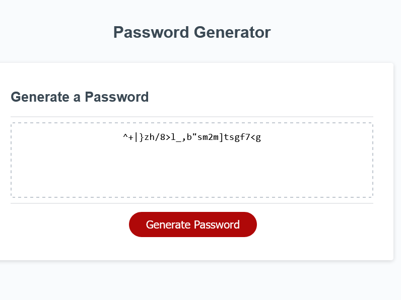

# JavaScript Password Generator

This is a simple password generator built using JavaScript. It allows users to generate a random password based on their chosen criteria, such as password length and character types. The generated password can then be copied and used for any purpose the user desires.
Features

    Customizable password length (between 8 and 128 characters)
    Option to include lowercase and/or uppercase letters, numbers, and/or special characters in the password
    Error handling for invalid input and when no character type is selected

## How to Use

    Go to this site: https://lohmarr.github.io/Password-Gen-Parakeet/

    

    Click the "Generate Password" button to start the password generation process.
    Enter a password length between 8 and 128 characters when prompted.
    Choose which types of characters to include in the password by selecting "OK" or "Cancel" for each option.
    Once all prompts have been answered, a random password will be generated and displayed on the screen.
    Click the "Copy to Clipboard" button to copy the password to your clipboard.

## Technologies Used

    HTML
    CSS
    JavaScript

## Credits

This password generator was built by Lohmar L'Amour as a project for the UNCC School of Professional Studies course on Full-Stack Web Development. The base HTML and CSS files were provided by the staff, but all JavaScript code was written by Lohmar L'Amour.
License

This project is licensed under the MIT license. See the LICENSE.md file for more details.
Acknowledgements